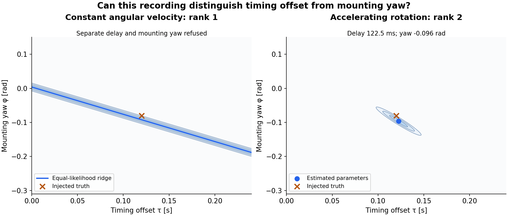
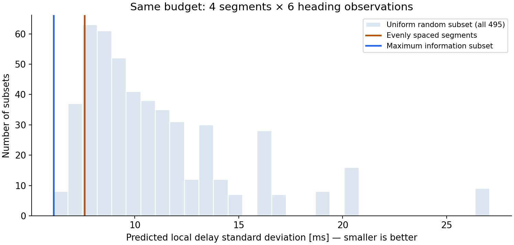

# Can this recording separate clock offset from mounting yaw?

This probe withholds separate clock-offset and mounting-yaw estimates when the
recording constrains only their combination. It uses one explicit heading model,
two figures and a reproducible numerical report.



**Contours are increments in negative log likelihood, ΔNLL = 1, 3, 6, measured
from each fit's minimum.** Both panels use the same Gaussian noise draw. The
orange cross is the injected truth; it need not lie at the fitted minimum.

**Rank is not precision:** with weak acceleration **a = 10⁻⁴ rad/s²**, the same
sampling schedule has **rank 2 but timing standard deviation σ_τ = 14.3 s**.
The report flags its weak direction. Those precision numbers use the known
measurement-noise level; the weak-motion check is evaluated on noiseless data
at the injected parameters.

## Reproduce

With Python **3.12** and a POSIX shell installed, run from this directory:

```sh
./reproduce.sh
```

The script creates a local `.venv`, installs the pinned requirements and runs
the probe with its assertions. It regenerates both figures,
`results/heading-results.json`, `results/heading-observations.csv` and
`results/heading-checks.log`. The first run downloads dependencies. To choose
a Python 3.12 executable, use `HEADING_PYTHON=/path/to/python3.12 ./reproduce.sh`.
The recorded run used Python 3.12.14 on CPU. No GPU performance is claimed.

## The model and the refusal

The reference heading is **known and unwrapped**, including its absolute offset:

```text
theta(t) = theta0 + omega0 * t + 0.5 * a * t²
z_k      = theta(t_k + tau) + phi + epsilon_k
epsilon_k ~ independent N(0, sigma²)
```

The two unknowns are clock offset `tau` in seconds and mounting yaw `phi` in
radians. For the main figure, there are 81 samples over 0–8 s, `theta0 = 0.2 rad`,
`omega0 = 0.8 rad/s`, known `sigma = 0.03 rad`, and injected parameters
`tau = 0.12 s`, `phi = -0.08 rad`. The declared parameter scales are
`0.1 s` and `0.1 rad`; the noise seed is `20260914`.

At constant angular velocity, the data constrain only
`0.8 * tau + phi`. Moving along `dphi/dtau = -0.8` leaves every predicted
measurement unchanged. The output therefore gives the combination estimate
and its standard deviation, with `tau`, `phi` and their individual covariance
set to `null`.

The left ridge follows the **combination MLE, 0.003737 rad**, rather than the
injected combination, **0.016 rad**. Its standard deviation is **0.003333 rad**.
This is the original retained noise realization; the injected truth and the
likelihood ridge are different objects.

| Motion | Local numerical rank | What the report supports |
|---|---:|---|
| Constant, a = 0 | 1 | Combination only; separate estimates withheld |
| Accelerating, a = 0.2 rad/s² | 2 | Estimated tau = 122.5 ms; local σ_τ = 7.13 ms |
| Weak acceleration, a = 10⁻⁴ rad/s² | 2 | Weak direction flagged; local σ_τ = 14.3 s |

These results assume a known reference trajectory and noise model. Reference
uncertainty, heading wrapping, clock drift, nuisance calibration parameters and
uncertain sensor dynamics are outside this probe. If the reference's absolute
heading offset were unknown, it would itself be confounded with mounting yaw.
The SVD report is local; structural nonidentifiability at constant rotation is
also established by the exact ridge identity.

## Equal-budget segment selection sanity check



**Under this quadratic reference, information selection is equivalent to
maximizing time spread. Every subset stays rank 1 at constant angular velocity.**
This checks the implementation and its refusal; it does not introduce a new
selection algorithm.

Each candidate segment contains six observations over 0.5 s. Four of twelve
segments are selected, so every choice uses 24 observations. All **495** subsets
are enumerated. The histogram is the exact distribution for a uniformly random
subset. Monte Carlo uses **5,000 paired full recordings**: all strategies select
from the same generated recording on each trial.

| Selection | Predicted timing uncertainty | Simulated timing RMSE |
|---|---:|---:|
| Maximum information | 6.09 ms | 5.98 ms |
| Even | 7.59 ms | 7.56 ms |
| Uniform random | 11.81 ms | 11.59 ms |

For random selection, the prediction is **sqrt(mean(conditional variance))**,
which matches the pooled Monte Carlo RMSE being measured. It is not the median
conditional standard deviation; that median is **9.92 ms**. The information
subset is `[0, 1, 10, 11]`; the even subset is `[0, 4, 7, 11]` (zero based).

## Numerical checks

The script checks the exact constant-rate ridge and refusal, agreement between
the quadratic-model regression solution and nonlinear least squares, noiseless
parameter recovery, invariance to timing units when physical scales are
preserved, repeated-time degeneracy, and weak-acceleration precision. Every
selected subset's covariance is checked against the exact timing-variance
formula, and the paired simulation is compared with the predicted variance.

Fitting and selection share the same covariance calculation from the whitened,
scaled Jacobian's SVD. The [technical note](TECHNICAL_NOTE.md) explains why
forming and inverting `J.T @ J` failed near degeneracy before the rank threshold
was crossed, and states the thresholds and local-covariance interpretation.

MIT licensed. This repository contains the heading experiment only.
